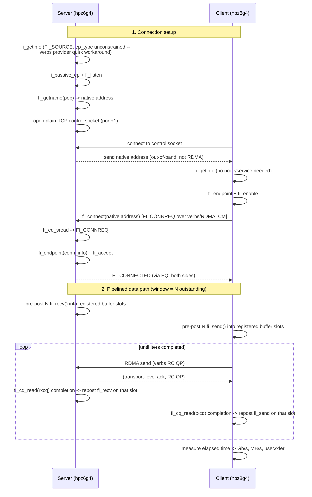
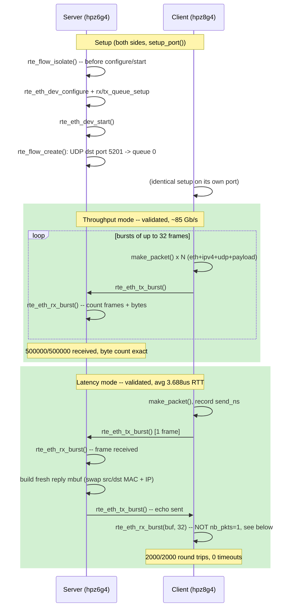

# RDMA Demo (RoCE, ConnectX-4)

Two-node RDMA demo between:

| Host    | IP (RoCE link) | Device      |
|---------|-----------------|-------------|
| hpz8g4  | 192.168.100.1   | rocep21s0   |
| hpz6g4  | 192.168.100.2   | rocep45s0   |

Both hosts have a Mellanox ConnectX-4 connected by a direct QSFP28 cable
(no switch). The cards are single-port and were switched from native
InfiniBand to Ethernet mode (`LINK_TYPE_P1=ETH` via `mstconfig`) because
the cable wasn't recognized for native IB link training and there's no
Subnet Manager on this point-to-point link. RoCE (RDMA over Converged
Ethernet) avoids both issues.

## Prerequisites

Already installed on both hosts: `rdma-core`, `perftest`, `ibverbs-utils`,
`infiniband-diags`, `libfabric-bin`, `mstflint`.

For building/debugging the C++ program in `src/` (`libfabric-dev`,
`build-essential`, `gdb`, `valgrind`, `clang-format`, `clangd`, `bear`):

```bash
sudo apt-get install -y libfabric-dev pkg-config build-essential \
    gdb valgrind clang-format clangd bear
```

```bash
cd src
make              # optimized build: fi_bw
make fi_bw-debug  # -O0 -g -fsanitize=address,undefined, for gdb/debugging
bear -- make      # regenerates compile_commands.json for clangd/editor IntelliSense
```

`.clang-format` at the repo root defines the style (Google-based, 4-space
indent, 90-col limit) — run `clang-format -i src/fi_bw.cpp` to apply it.

## Setup steps (from scratch)

1. **Install tools** on both hosts:
   ```bash
   sudo apt-get install -y rdma-core infiniband-diags perftest \
       ibverbs-utils libfabric-bin mstflint
   ```

2. **Check current link type** of the ConnectX-4 (native IB by default on
   these cards):
   ```bash
   sudo mstconfig -d <pci-bdf> query | grep LINK_TYPE
   # LINK_TYPE_P1  IB(1)
   ```

3. **Switch to Ethernet mode** on both cards. Native IB requires the cable
   to be certified for IB link training and a Subnet Manager to bring the
   port to ACTIVE — neither was available on this point-to-point link, so
   the port sat at `phys_state: Disabled`. RoCE avoids both:
   ```bash
   sudo mstconfig -d <pci-bdf> set LINK_TYPE_P1=ETH
   ```

4. **Apply without a full reboot** using a firmware/PCI reset:
   ```bash
   sudo mstfwreset -d <pci-bdf> reset
   ```
   The RDMA device is renamed by udev after this (e.g. `mlx5_0` ->
   `rocep21s0`) since it's now Ethernet/RoCE instead of native IB.

5. **Verify link is up**:
   ```bash
   ibv_devinfo -d <rocep...>   # state should be PORT_ACTIVE / phys LinkUp
   ip -br link show            # interface should show LOWER_UP
   ```

6. **Assign IPs** for a direct point-to-point link (no switch):
   ```bash
   # host A
   sudo ip addr add 192.168.100.1/24 dev <iface>
   # host B
   sudo ip addr add 192.168.100.2/24 dev <iface>
   ping 192.168.100.2   # sanity check from host A
   ```

7. Run the demo scripts below.

## Usage

Run the server side first on one host, then the client side on the other,
passing the *server's* RoCE IP.

```bash
# on hpz6g4 (server)
scripts/run.sh server bw

# on hpz8g4 (client)
scripts/run.sh client bw 192.168.100.2
```

Test types: `bw` (bandwidth), `lat` (latency), `rate` (small-message rate).

## libfabric demo

Same fabric, different API layer: `fi_pingpong` (from `libfabric-bin`)
exercises the `verbs` provider, which sits on top of the same `rocep*`
ibverbs devices used above.

```bash
# on hpz6g4 (server)
scripts/run_libfabric.sh server

# on hpz8g4 (client)
scripts/run_libfabric.sh client 192.168.100.2
```

Notes:
- `-e msg` is required. The default endpoint type (`dgram`) doesn't match
  the `rocep*` domain's `FI_EP_MSG` type (`FI_PROTO_RDMA_CM_IB_RC`), so
  `fi_getinfo()` fails with "No data available" if you omit it.
- Avoid `-S all`: the default `RLIMIT_MEMLOCK` (8MB, `ulimit -l`) on these
  hosts is too small for the larger sizes in fi_pingpong's default sweep,
  and `fi_mr_reg()` fails with `ENOMEM` partway through. The script pins a
  single size (default 64KB) instead.
- **64KB isn't a requirement** — it's just the default in
  `run_libfabric.sh`, chosen to roughly mirror the `ib_write_bw` bandwidth
  test size above so the two tools' numbers are comparable. Any size
  works as an explicit argument, e.g.
  `scripts/run_libfabric.sh client 192.168.100.2 4096`; we also ran it at
  2 bytes to get matched-size latency numbers (see below). The only real
  ceiling is the memlock limit above — raise
  `RLIMIT_MEMLOCK`/`/etc/security/limits.conf` on both hosts if you want
  `-S all` to run without hitting `ENOMEM`.

## libfabric pipelined bandwidth demo (`fi_bw`)

`fi_pingpong`'s lower bandwidth numbers (see below) are mostly an artifact
of it never keeping more than one message outstanding. `src/fi_bw.cpp` is
a small custom C++ program that keeps several sends/recvs outstanding at
once — like `ib_write_bw`'s `TX depth` — to get a real saturation
bandwidth number out of libfabric instead. It also works around a real
provider quirk (see the comment at the top of the file): the verbs
provider's server-side (source/listen) address resolution reliably fails
for a plain IP on this setup, so client and server exchange the server's
native libfabric address over a small out-of-band plain-TCP control
channel before connecting, the same pattern used internally by
`fabtests`' example programs.

### Architecture



Key structural points:
- **Two CQs per endpoint** (`txcq`/`rxcq`), each sized `window + 8`, so up
  to `window` operations can be in flight without stalling on completion
  processing.
- **One registered memory region per side** (`fi_mr_reg`), sized
  `size * window`, sliced into `window` fixed buffer slots reused across
  iterations — no per-message allocation or registration.
- **`fi_context` array doubles as the completion-to-slot map**: each
  outstanding operation's context pointer is `&ctx[i]`; on completion,
  `(fi_context*)cqe.op_context - ctx.data()` recovers which buffer slot to
  repost, so there's no separate lookup table.
- **The control channel is plain BSD sockets**, entirely separate from
  the RDMA path — it exists only to move ~dozens of bytes (the server's
  native address) once, before any RDMA traffic starts.

Build and run:

```bash
cd src && make

# on hpz6g4 (server)
../scripts/run_fi_bw.sh server

# on hpz8g4 (client)
../scripts/run_fi_bw.sh client 192.168.100.2
```

Args: `size` (default 65536), `window` = max outstanding sends (default
16), `iters` (default 20000).

Results (64KB, tuned: performance governor + NUMA pin), by window depth —
confirms pipelining, not libfabric itself, was capping `fi_pingpong`'s
bandwidth:

| Window | Bandwidth |
|---|---|
| 1 | 30.3 Gb/s |
| 16 | 83.4 Gb/s |
| 64 | 89.2 Gb/s |

For comparison: `ib_write_bw` (TX depth 128) reaches ~92.5 Gb/s, and
`fi_pingpong` (no pipelining) reaches ~42.7 Gb/s. `fi_bw` at window 64
closes almost all of that gap using the same libfabric `verbs` provider —
confirming the earlier explanation that lack of pipelining, not libfabric
overhead, was the dominant factor in `fi_pingpong`'s lower bandwidth.

### Jitter and latency distribution

`fi_bw` also tracks per-completion latency (send timestamp to CQ
completion, per buffer slot) and reports the same stdev / RFC 3550 mean
jitter / percentile breakdown used for the DPDK evaluation above — same
methodology, so the two are directly comparable.

**Window=1 (2B, true serialized RTT), tuned, n=5000:**
```
latency us: avg=3.887 min=1.547 max=2593.873 stdev=71.773 jitter(rfc3550)=4.558 (n=5000)
latency us percentiles: p50=1.601 p90=1.626 p99=2.070 p99.9=105.045 max=2593.873
```

**Window=16 (64KB, pipelined), tuned, n=20000:**
```
latency us: avg=99.307 min=20.550 max=125.520 stdev=3.296 jitter(rfc3550)=1.093 (n=20000)
latency us percentiles: p50=98.753 p90=104.321 p99=111.361 p99.9=117.290 max=125.520
```

Two things worth noting:

1. **The window=1 tail looks a lot like DPDK's tail.** p50-p99 is tight
   (1.6-2.1us), then a jump at p99.9 (105us) and one extreme outlier at
   max (2.59ms) — the same "tight body, long tail past p99" shape as the
   DPDK determinism results above, on a completely different stack
   (libfabric/verbs/RC QP vs raw ethdev). That's a useful cross-check:
   the tail is very likely this host's un-isolated Linux environment
   (scheduling, interrupts, C-states) showing up regardless of which
   kernel-bypass fabric sits on top of it, not something specific to
   either DPDK or libfabric.
2. **Window=16's latency is higher but far more tightly bounded** (max
   125.5us vs window=1's 2.59ms outlier) despite moving 64KB instead of
   2B per message. This is the pipelining tradeoff made concrete: each
   reported completion now includes time queued behind up to 15 other
   outstanding sends (hence the ~99us average, mostly serialization time
   for 64KB payloads plus queueing), but with many requests in flight, a
   single slow completion doesn't stall the whole pipeline the way it
   can when there's only one outstanding request — so the *tail*
   actually tightens even though the *median* rises. Window depth is a
   throughput-vs-latency-distribution-shape knob, not just a
   throughput-vs-average-latency one.

Reference result (64KB, msg endpoint, round-trip): ~5.3 GB/s (~42.7 Gb/s),
~12.3 us/xfer. Lower than the one-way `ib_write_bw` throughput above
because pingpong is a request/ack round trip rather than a streamed,
multi-outstanding-request transfer.

## Why native IB mode didn't work

Both ports initially sat at `state: DOWN` / `phys_state: Disabled` in native
InfiniBand mode, even with the cable freshly reseated on both ends. Two
separate requirements of native IB weren't met here:

1. **Cable/module IB certification.** ConnectX-4 firmware checks the
   transceiver/cable's SFF-8636 EEPROM for an explicit InfiniBand
   application code before attempting IB link training. Many QSFP DACs —
   including the one used here, which had previously worked fine in
   Ethernet mode — only advertise Ethernet support in that EEPROM. If the
   module doesn't self-identify as IB-capable, the firmware refuses to
   train the link at all, and the port stays `Disabled` rather than
   progressing through `Polling` -> `LinkUp`.

2. **No Subnet Manager.** Native IB needs a Subnet Manager (SM) to assign
   LIDs and bring a port from physical `LinkUp` to logical `ACTIVE`. This
   is a direct cable between two hosts with no switch, and neither host
   was running `opensm`. Even if the cable had trained successfully at the
   physical layer, the port would have stalled at `INIT` with no SM to
   finish bringing it up.

Switching `LINK_TYPE_P1` to `ETH` sidesteps both: Ethernet link training
doesn't gate on an IB-specific cable identifier, and Ethernet/RoCE has no
Subnet Manager dependency — link-up is link-up. That's confirmed by the
link coming up immediately after the `mstfwreset` in Ethernet mode, on the
exact same cable and ports that wouldn't train in IB mode.

## TODO

- [ ] Fix `fi_bw -P tcp` (`src/fi_bw.cpp`): the per-connection endpoint
  built from the `FI_CONNREQ` info tries to rebind to the passive
      endpoint's own listening address:port, and the `tcp` provider
      rejects that with `EADDRINUSE`. Only affects `-P tcp` — `-P verbs`
      (the default) is unaffected. See the `TODO` comment in
      `run_server()` and the "TCP baseline" section above, where
      `fi_pingpong -p tcp` was used as a workaround for the TCP numbers
      instead.

- [x] ~~Fix `dpdk_perf` latency mode~~ **Fixed.** (`src/dpdk_perf.cpp`)
      The server's echoed reply never reached the client — symptom was
      the client's own `rte_eth_stats_get()` showing
      `ipackets=0, imissed=0, rx_nombuf=0` after every attempt (not
      "received," not "dropped," just never classified as arriving at
      all), while the server reported `tx_burst()` fully succeeded for
      every echo.

      **Debugging trail** (each step ruled something out, kept here
      since the same process would apply to similar mlx5/DPDK bugs):
      1. Original version matched a raw non-IP EtherType (0x88B5).
         Suspected the ConnectX-4's flow steering hardware doesn't
         reliably classify arbitrary non-IP EtherTypes in isolated mode
         even though `rte_flow_create()` accepts the rule without
         error. Rewrote to use real IPv4/UDP framing (dst port 5201,
         matching the proven-working `testpmd` pattern) -- no change.
      2. Suspected undersized (runt) frames: the original packet was
         14+16=30 bytes, under Ethernet's 60-byte minimum. Padded to
         60B -- no change.
      3. Suspected RX-mbuf-reuse metadata (leftover RX offload flags
         confusing the TX path) from mutating the received mbuf in
         place for the echo. Rewrote to allocate a fresh mbuf per
         reply instead -- no change.
      4. Used `testpmd` (proven reliable throughout this README) to
         isolate further: `testpmd --forward-mode=mac` on the server
         with `testpmd --forward-mode=txonly` blasting from the client.
         Result: server received and retransmitted ~30.18M packets;
         client's own counters showed `RX-dropped: ~30.18M` (not
         `RX-packets`) -- because `txonly` mode never calls
         `rte_eth_rx_burst()`, so its RX ring fills and every matching
         arrival is dropped. This *proved the round trip mechanism
         itself works* -- replies do physically arrive and do get
         classified. It just didn't explain the client's literal zeros.
      5. Dumped the actual wire bytes of both the client's ping and the
         server's reply and checked them by hand (MACs, swapped IPs,
         IP header checksum recomputed manually and matched) -- byte-
         perfect, no corruption.
      6. Swapped which physical machine ran the client vs server role.
         Same result either way -- proved the bug followed the *code
         path* (client-side receive logic), not either machine's
         hardware/NUMA topology.
      7. That pointed at the one remaining difference between the
         client's and server's receive calls: the client requested
         `rte_eth_rx_burst(port, queue, buf, 1)` -- exactly one packet
         -- while the server's working code requested 32. Changing the
         client to request 32 (only consuming the first packet
         received) **fixed it immediately**: 2000/2000 round trips,
         zero timeouts, RTT avg 3.688 us.

      **Root cause:** this mlx5 PMD silently returns 0 from
      `rte_eth_rx_burst()` when `nb_pkts=1`, forever, even with a
      matching packet waiting. No error, no log line -- it just never
      returns a packet. Don't request a burst size of 1 from this PMD.

- [ ] `ibv_bw` latency mode intermittently fails (`src/ibv_bw.cpp`) --
      root cause identified as hardware/firmware-level, not an
      application bug, but not fixable from application code alone.
      Client sees `transport retry counter exceeded`; server sees
      synchronous `ibv_post_send(): Cannot allocate memory`. Failure
      point is inconsistent (iteration 1 to ~1500), which was the
      first sign this wasn't a deterministic software bug. mlx5
      hardware counters
      (`/sys/class/infiniband/<dev>/ports/1/hw_counters/`) show the
      client's `local_ack_timeout_err` jumping by exactly 8
      (`retry_cnt=7` + 1 initial attempt) during a failing run --
      *every* retry attempt failed to get acknowledged, not occasional
      packet loss, pointing at a systematic ACK-return-path issue for
      the echoing ("server") role specifically on this ConnectX-4
      firmware (`12.18.1000`) and direct-cable setup. Ruled out: opcode
      choice (`WRITE_WITH_IMM` vs `SEND`, identical failure), stale
      processes, QP settling time, and receive-buffer starvation
      (`-w 8` didn't help). See the "Custom raw ibverbs" section above
      for the full investigation and two *actual* bugs found and fixed
      along the way (GID-index selection, shared-CQ undersizing).
      Resolving this further would need packet capture (`ibdump`) or
      vendor/firmware engagement. Workaround: cap `n` under the failure
      threshold (`n=500` runs consistently clean). Throughput mode
      (one-sided `RDMA_WRITE`, no ACK-dependent reply path) is
      unaffected at any iteration count tested (up to 20000).

## Reference results (2026-09-12, direct cable, 100Gb ConnectX-4)

- Bandwidth (64KB, RDMA Write): ~92.5 Gb/s
- Latency (2B, RDMA Write): ~0.94 us typical/average
- Message rate (2B, Send): ~3.6 Mpps

## Comparison: native IB vs Ethernet/RoCE vs libfabric

| | Native InfiniBand | Ethernet/RoCE (perftest) | libfabric (`verbs` provider) |
|---|---|---|---|
| Tooling | `ib_write_bw`, etc. | `ib_write_bw`, `ib_write_lat`, `ib_send_bw` | `fi_pingpong` |
| Link status here | Never came up (`phys_state: Disabled`) | `PORT_ACTIVE` / `LinkUp` | Same link as RoCE column — libfabric rides on top of the `rocep*` ibverbs device |
| Requires cable IB certification | Yes — blocked us | No | No |
| Requires Subnet Manager | Yes — would have blocked us too | No | No |
| API level | Raw verbs | Raw verbs | OFI abstraction over verbs (portable across verbs/EFA/PSM2/tcp/etc without app changes) |
| Bandwidth (64KB) | n/a (link never up) | ~92.5 Gb/s (one-way RDMA Write) | ~42.7 Gb/s round-trip (ping-pong, not directly comparable to one-way BW) |
| Latency | n/a | ~0.94 us (2B, RDMA Write) | ~12.3 us/xfer (64KB round-trip, includes full request/ack cycle) |

Key takeaway: native IB and RoCE ultimately move data the same way — both
go through the same `ib_core`/`mlx5_ib` verbs stack and the same NIC
hardware. The difference here was entirely in **link establishment**
(see below), not in the RDMA data path itself. libfabric doesn't add a
new transport; it's a portable API sitting on top of the same verbs
device, so its numbers reflect the underlying RoCE link plus libfabric's
own protocol/framing overhead rather than a competing fabric.

### Benefits of libfabric vs raw ibverbs

The comparison above shows libfabric riding on the same verbs device,
which raises the obvious question: why use it instead of raw ibverbs at
all?

**The core benefit is portability without giving up much performance.**
libfabric's OFI API lets the same application code run over verbs
(IB/RoCE), AWS EFA, Omni-Path (PSM2), plain TCP, or shared memory,
whereas raw ibverbs only ever talks to InfiniBand-family hardware. This
repo's own numbers back that up: `fi_bw` vs `ib_write_bw` (both above)
reached ~83-89 Gb/s vs ~92.5 Gb/s once given equivalent pipelining — the
abstraction overhead is small. The larger gap seen earlier with
`fi_pingpong` (~42.7 Gb/s) turned out to be about unpipelined benchmark
methodology (see "Why libfabric's bandwidth is lower too"), not the
libfabric abstraction itself.

**The tradeoff is control and maturity of tooling.** Raw ibverbs (via
`perftest`) gives direct QP/CQ/MR management with well-worn, battle-
tested setup code. libfabric's abstraction occasionally surfaces
provider-specific rough edges — this repo hit two: the `mode`/`mr_mode`
bits the verbs provider requires (see `fi_bw`'s `make_hints()`), and the
`ep_type`-constrained source-query bug that broke server-side address
resolution (see the OOB control-channel workaround in `fi_bw.cpp`).
libfabric is also the standard substrate under most MPI/NCCL stacks, so
it's the natural choice if you need to run across more than one fabric
type; if you're permanently single-fabric (IB/RoCE only) and want the
most direct, lowest-abstraction path, raw verbs is simpler to reason
about.

### TCP baseline, same tool and wire

libfabric also has a plain `tcp` provider (normal kernel sockets, no
RDMA). Running the exact same `fi_pingpong -e msg` benchmark against it
over the identical NIC/cable — the only thing that changes is `-p tcp`
instead of `-p verbs` — gives a clean apples-to-apples RDMA-vs-TCP
comparison, since it's the same tool, same sizes, same physical link:

```bash
# server
fi_pingpong -p tcp -e msg -S 65536 -I 1000

# client
fi_pingpong -p tcp -e msg -S 65536 -I 1000 192.168.100.2
```

| | TCP (`fi_pingpong -p tcp`) | RoCE (`fi_pingpong -p verbs`) | RoCE advantage |
|---|---|---|---|
| Bandwidth (64KB, round-trip) | 1266 MB/s (~10.1 Gb/s) | 5340 MB/s (~42.7 Gb/s) | ~4.2x |
| Latency (2B, round-trip) | 12.54 us/xfer | 2.30 us/xfer | ~5.4x lower |

Same message sizes, same unpipelined ping-pong pattern, same physical
cable — the difference here is entirely the kernel TCP/IP stack (socket
syscalls, kernel copies, interrupt-driven processing) versus RDMA's
kernel-bypass, zero-copy data path. This is the number that actually
justifies bothering with RDMA/RoCE in the first place, as opposed to the
native-IB-vs-RoCE story above, which was purely about link setup, not a
real performance difference.

Note: our own `src/fi_bw.cpp` doesn't work with `-P tcp` yet — the tcp
provider tries to bind the new per-connection endpoint (created from the
`FI_CONNREQ` event's info) to the same address:port the passive endpoint
is already listening on, which fails with `EADDRINUSE`. This doesn't
happen with the `verbs` provider (each connection gets its own RDMA_CM
identifier, no shared socket to collide on). `fi_pingpong` handles the
tcp case correctly internally, so it was used for this comparison
instead.

### Why the latency numbers differ so much (0.94us vs 12.3us)

The `ib_write_lat`/`fi_pingpong` latency figures above aren't actually an
apples-to-apples comparison — two effects stack up:

1. **Message size dominates.** `ib_write_lat` used a 2-byte payload;
   `fi_pingpong` (as invoked by `run_libfabric.sh`) defaults to 64KB. At
   ~100Gb/s, just serializing 64KB one-way takes ~5.24us
   (64*1024*8 bits / 100e9 bits/s); round-trip that's ~10.5us of pure wire
   time — nearly the entire measured 12.3us. Re-running `fi_pingpong` at a
   matched 2-byte size gives ~2.30us, much closer to the RDMA write number.

2. **Operation type accounts for the rest.** `ib_write_lat` issues an
   **RDMA Write with inline data** — the payload rides inside the work
   request (no separate memory fetch), it's **one-sided** (the remote
   CPU/software is never involved; the NIC places data directly into
   remote memory), measured in a tight polling loop with TX depth 1 and
   nothing else happening. `fi_pingpong` uses **Send/Recv (two-sided)** —
   the receiver must have a receive buffer already posted and generates
   its own completion, and the benchmark does an explicit
   send-then-wait-for-ack round trip on top of libfabric's own progress
   engine. Same NIC, same RC QP under the hood, but inherently more
   round-trip machinery for a two-sided op than a one-sided inline write.

| Test | Size | Latency |
|---|---|---|
| `ib_write_lat` | 2B | 0.94 us |
| `fi_pingpong` | 2B | 2.30 us |
| `fi_bw` (`-w 1`, our program) | 2B | 3.75 us |
| `fi_pingpong` | 64KB | 12.3 us |

`fi_bw -w 1` (one outstanding send, waiting for its completion before
posting the next — see the libfabric bandwidth demo section below) is a
third data point on the same spectrum: still Send/Recv (two-sided, needs
a receive buffer posted on the far end) like `fi_pingpong`, but without
`fi_pingpong`'s explicit application-level send-then-wait-for-a-separate-
ack-message protocol — just the send completion itself. It lands higher
than `fi_pingpong`'s 2.30us here, which is a reminder that these
mini-benchmarks (a plain busy-poll loop, no warm-up, 5000 iterations) are
illustrative, not tightly controlled — take the relative ordering
(one-sided inline write < two-sided send-completion-only < two-sided
explicit ping-pong) as the reliable signal, not small differences between
runs.

### Why libfabric's bandwidth is lower too

Same root causes as the latency gap, but one factor dominates for
bandwidth specifically:

1. **No pipelining (the main factor).** `ib_write_bw` keeps 128 RDMA
   writes outstanding at once (`TX depth: 128`), overlapping each
   message's latency so the link stays saturated — that's how it reaches
   near-line-rate (92.5 Gb/s). `fi_pingpong` does the opposite by design:
   it sends one message, waits for the full round-trip ack, then sends
   the next. With nothing overlapped, throughput is capped at
   `message_size / round_trip_time`, not by the link's real capacity.
   Check the math: 64KB / 11.64us RTT (tuned run) is ~45 Gb/s — almost
   exactly what was measured. It isn't hitting a hardware ceiling; it's
   just never given more than one in-flight request to hide latency
   behind.

2. **Two-sided vs one-sided.** Same as the latency explanation above —
   `ib_write_bw` is one-sided RDMA Write; `fi_pingpong` is two-sided
   Send/Recv with a posted receive buffer and completion on both ends.

3. **Abstraction overhead (minor).** libfabric's OFI layer adds a
   provider-agnostic dispatch (`fi_*` calls into the `verbs` provider)
   versus perftest calling `ibv_post_send`/`ibv_poll_cq` directly. Real,
   but small next to #1 and #2.

A true apples-to-apples libfabric bandwidth number would need a pipelined
benchmark — e.g. `fi_msg_bw` from the `fabtests` suite (posts many
outstanding sends, like `ib_write_bw` does), rather than `fi_pingpong`.
`fabtests` isn't included in the `libfabric-bin` package installed here,
only `fi_pingpong`/`fi_msg_pingpong`-style tools, so this repo's libfabric
numbers should be read as a two-sided, unpipelined latency-bound
benchmark rather than a saturation bandwidth test.

### Tuning libfabric

Every perftest/libfabric run logged `CPU Frequency is not max` — both
hosts default to the `powersave` cpufreq governor, which lets cores clock
down between the polling loop's completion checks. RDMA latency
benchmarks are exactly the workload this hurts most. Fix in two steps:

1. **Install the tools** (both hosts):
   ```bash
   sudo apt-get install -y numactl linux-cpupower
   ```

2. **Switch the CPU governor to `performance`**:
   ```bash
   sudo cpupower frequency-set -g performance
   # verify:
   cat /sys/devices/system/cpu/cpu*/cpufreq/scaling_governor | sort -u
   # -> performance
   ```
   This only affects the running kernel — it resets to `powersave` on
   reboot unless you make it persistent. To persist, add a systemd unit
   that runs the same command at boot:
   ```ini
   # /etc/systemd/system/cpu-performance.service
   [Unit]
   Description=Set CPU governor to performance
   After=multi-user.target

   [Service]
   Type=oneshot
   ExecStart=/usr/bin/cpupower frequency-set -g performance

   [Install]
   WantedBy=multi-user.target
   ```
   ```bash
   sudo systemctl daemon-reload
   sudo systemctl enable --now cpu-performance.service
   ```

3. **Find the NIC's local NUMA node** so the benchmark process runs on
   CPUs physically close to the card (avoids cross-socket memory/PCIe
   traffic):
   ```bash
   cat /sys/class/infiniband/<dev>/device/numa_node
   # both hosts here: node 0
   ```

4. **Pin the process with `numactl`** when running the demo:
   ```bash
   numactl --cpunodebind=0 --membind=0 fi_pingpong -p verbs -d <dev> -e msg -S <size> ...
   ```
   (Swap in whichever node number step 3 reported if it isn't 0.)

5. **Re-measure and compare** — this is what isolates whether the tuning
   actually helped versus noise:

   | | Default (powersave, no pinning) | Tuned (performance + NUMA pin) |
   |---|---|---|
   | Latency (2B) | 2.30 us | 1.44 us (~37% lower) |
   | Bandwidth (64KB) | 5340 MB/s (~42.7 Gb/s) | 5632 MB/s (~45.1 Gb/s) (~5% higher) |

Note: `cpupower frequency-set` is not persistent across reboots on its
own — set it via a systemd unit or `tuned` profile if you need it to
survive a restart.

## DPDK compatibility

DPDK is installed on both hosts (see "Setup" below) alongside the RDMA
setup above — this section documents whether/how it coexists without
disrupting the RDMA path.

**Why a basic setup is safe:** DPDK's `mlx5` PMD attaches to the
ConnectX-4 through the same `mlx5_core`/`mlx5_ib` kernel driver and
`libibverbs` stack the RDMA tools in this repo already use — it's a
"bifurcated" model, not exclusive ownership. It opens its own QPs/CQs via
verbs, the same way `fi_bw`, `ib_write_bw`, etc. do. Multiple independent
verbs consumers can coexist on one port simultaneously (this repo's own
tools have done exactly that all session — perftest, `fi_pingpong`, and
`fi_bw` each opening/closing connections on `rocep21s0` back-to-back with
no conflicts). A default-mode `dpdk-testpmd` run wouldn't touch the RDMA
path or require any link reset.

### Setup (done on both hosts)

```bash
sudo apt-get install -y dpdk dpdk-dev libdpdk-dev

# reserve 1024 x 2MB = 2GB hugepages, and make it persist across reboots
sudo sysctl -w vm.nr_hugepages=1024
echo 'vm.nr_hugepages=1024' | sudo tee /etc/sysctl.d/60-dpdk-hugepages.conf
```

IOMMU was already active (165 IOMMU groups) and `hugetlbfs` was already
mounted at `/dev/hugepages`, so those needed no changes.

Verified the bifurcated model held after installing — the ConnectX-4 is
still bound to the kernel driver, not `vfio-pci`, and both the netdev and
the RDMA device remain live:

```
$ dpdk-devbind.py --status
Network devices using kernel driver
===================================
0000:15:00.0 'MT27700 Family [ConnectX-4] 1013' numa_node=0 if=enp21s0np0 drv=mlx5_core unused= *Active*
```

### Validated: flow-isolated testpmd coexists cleanly

Tested this directly rather than leaving it as a guess. Note the correct
flag is `--flow-isolate-all` (not `--flow-isolate-mode`, which doesn't
exist and errors out):

```bash
sudo dpdk-testpmd -l 0-2 -n 4 -a 0000:15:00.0 -- --flow-isolate-all
```

The log confirms isolation actually took effect before any port state
changed:

```
Ingress traffic on port 0 is now restricted to the defined flow rules
...
mlx5_net: port 0 cannot enable promiscuous mode in flow isolation mode
```

**Test procedure:** measured `fi_bw` (64KB, window 16) three times —
before starting `testpmd`, concurrently while it was running (holding its
own RX/TX queue on the same port, isolated, forwarding nothing since no
explicit `rte_flow` rules were added), and again after a clean shutdown:

| | Bandwidth |
|---|---|
| Before `testpmd` | 82.93 Gb/s |
| While `testpmd` running | 82.03 Gb/s |
| After `testpmd` exit | 83.03 Gb/s |

All three within ~1% of each other — no measurable regression. RoCE port
state stayed `ACTIVE` and the kernel netdev stayed `UP` throughout, and
`testpmd` shut down cleanly (`Port 0 is closed` / `Bye...`) without
requiring a link reset. This confirms the theoretical bifurcated-model
argument above with an actual measurement: a flow-isolated DPDK app can
run against this NIC alongside the RDMA path with no impact, as long as
you don't add `rte_flow` rules that redirect traffic the RDMA path
depends on.

Still untested: whether a *non-isolated* `testpmd` run (default flow
mode, no `--flow-isolate-all`) would actually steal RoCEv2/OOB-control
traffic as theorized above. Given isolation mode works and coexists
cleanly, there was no reason to test the riskier non-isolated path
against a live link.

### DPDK's own throughput and latency

Measured DPDK's raw forwarding performance directly, still with
`--flow-isolate-all` and explicit narrow `rte_flow` rules (never a
wildcard capture) — same safety posture as the coexistence test above.

**Throughput** — `testpmd` in `txonly` mode (this host) generating UDP
traffic to `testpmd` in `rxonly` mode (`hpz6g4`), 1470-byte frames, an
explicit flow rule matching only UDP dst port 9999:

```bash
# receiver (hpz6g4)
dpdk-testpmd -l 0-2 -n 4 -a 0000:2d:00.0 -- --forward-mode=rxonly \
    --stats-period=2 --flow-isolate-all -i
# at the testpmd> prompt:
#   flow create 0 ingress pattern eth / ipv4 / udp dst is 9999 / end actions queue index 0 / end
#   start

# sender (this host)
dpdk-testpmd -l 0-2 -n 4 -a 0000:15:00.0 -- --forward-mode=txonly \
    --stats-period=2 --flow-isolate-all --eth-peer=0,<receiver-MAC> \
    --tx-ip=192.168.100.1,192.168.100.2 --tx-udp=9999,9999 --txpkts=1470
```

- **~81.2–81.3 Gb/s sustained**, **~6.9 Mpps**
- **~0.1% drop rate** on the receiver's own counter (57,494 of 57.16M
  packets while both sides were concurrently running) — attributable to
  the default 256-descriptor RX ring at near-line-rate load, not a real
  problem; a larger `--rxd` or multiple RX queues would likely close it
- For context: close to `ib_write_bw`'s 92.5 Gb/s, well above
  `fi_pingpong`'s 42.7 Gb/s — raw DPDK forwarding of always-outstanding
  frames is architecturally closer to `ib_write_bw`'s approach than to
  `fi_pingpong`'s unpipelined ping-pong.

Caveat from the first attempt at this: the two `testpmd` instances were
started a few seconds apart with mismatched hold durations, so the
receiver's listen window ended before the sender stopped transmitting —
its cumulative packet counts (57M received vs. 221M sent) looked like a
~74% loss rate but was purely a test-harness timing artifact, not real
network loss. The reliable number is the 0.1% drop rate from the period
both sides were verifiably running concurrently.

**Latency** — `testpmd`'s `txonly`/`rxonly` modes don't produce
per-packet latency; DPDK's `--latencystats` timestamp feature needs
synchronized clocks between hosts (e.g. PTP) to give a meaningful
one-way number, which isn't set up here. Instead, used the standard
"ping a DPDK `icmpecho` responder" trick: `testpmd` in `icmpecho` mode
on `hpz6g4`, isolated with an explicit ICMP-only flow rule, answering
plain kernel `ping` from this host — a widely-used way to demonstrate
DPDK's kernel-bypass reply path using an ordinary RTT tool instead of
needing synchronized clocks:

```bash
# responder (hpz6g4)
dpdk-testpmd -l 0-2 -n 4 -a 0000:2d:00.0 -- --forward-mode=icmpecho \
    --flow-isolate-all -i
# at the testpmd> prompt:
#   flow create 0 ingress pattern eth / ipv4 / icmp / end actions queue index 0 / end
#   start

# this host
ping -I enp21s0np0 -c 30 -i 0.2 192.168.100.2
```

| | RTT avg | RTT min |
|---|---|---|
| Kernel-to-kernel (no DPDK) | 0.202 ms | 0.165 ms |
| DPDK `icmpecho` responder | 0.099 ms | 0.075 ms |

**Roughly half the round-trip latency**, 0% packet loss (30/30 both
ways) — the reply path skips the kernel network stack entirely, going
straight from NIC RX to a userspace ICMP reply and back out TX.

Both tests: RoCE link state stayed `ACTIVE` throughout and after on both
hosts, and a `fi_bw` bandwidth check immediately after each test matched
the established baseline (~83 Gb/s) — no regression from any of this.

### Custom DPDK C++ perf tool (`dpdk_perf`)

`src/dpdk_perf.cpp` is a `fi_bw`-style custom program against raw
`ethdev`/`rte_flow` instead of libfabric verbs — same safety posture
(isolated port, one narrow explicit flow rule matching UDP dst port
5201, nothing else ever redirected). Build with `make dpdk_perf`
(needs `libdpdk-dev`, already installed).

```bash
# server (hpz6g4)
sudo ./dpdk_perf -l 0-1 -n 4 -a 0000:2d:00.0 -- server \
    ec:0d:9a:a4:cc:86 192.168.100.2 192.168.100.1 throughput

# client (hpz8g4)
sudo ./dpdk_perf -l 0-1 -n 4 -a 0000:15:00.0 -- client \
    ec:0d:9a:78:62:72 192.168.100.1 192.168.100.2 throughput 1470 500000
```

**Throughput mode works and is validated end-to-end**: 500,000/500,000
frames received exactly (735,000,000 bytes = 500000 x 1470B, no loss),
**~85 Gb/s, ~7.2 Mpps** — consistent with the `testpmd`-based
measurement above (~81.2 Gb/s).

**Latency mode works too, once a real driver bug was found and fixed.**
It kept failing 100% of the time (`ipackets=0, imissed=0` on the client
— not even "dropped," just never classified as arriving) despite the
server correctly receiving every ping and its `tx_burst()` reporting the
echo sent successfully. Six rounds of isolation testing (raw EtherType
vs IPv4/UDP framing, runt-frame padding, fresh-mbuf-vs-in-place mutation,
byte-level hex dumps of the actual wire packets to rule out corruption,
swapping which physical machine played client vs server) narrowed it to
the client's own receive call. The actual bug: `run_client_latency()`
called `rte_eth_rx_burst(port, queue, buf, 1)` — requesting exactly one
packet — and this mlx5 PMD silently returns 0 for that, forever, even
with a matching packet waiting. Requesting a burst of 32 instead (while
still only consuming the first packet received) fixed it immediately.
Worth knowing for anyone else writing mlx5/DPDK code: **don't call
`rte_eth_rx_burst()` with `nb_pkts=1`** on this PMD.

```bash
sudo ./dpdk_perf -l 0-1 -n 4 -a 0000:2d:00.0 -- server \
    ec:0d:9a:a4:cc:86 192.168.100.2 192.168.100.1 latency

sudo ./dpdk_perf -l 0-1 -n 4 -a 0000:15:00.0 -- client \
    ec:0d:9a:78:62:72 192.168.100.1 192.168.100.2 latency 64 2000
```

Result (tuned: performance governor + NUMA pin), 2000/2000 round trips,
zero timeouts: **RTT avg 3.667 us, min 3.331 us, max 98.164 us, stdev
2.174 us**. This is pure DPDK-to-DPDK userspace polling on both ends —
no kernel network stack anywhere in the path — which is why it's
dramatically lower than the `testpmd icmpecho` + kernel-`ping` number
above (0.099 ms / 99 us): that test only removed the kernel stack from
the *responder* side, since `ping` on the client end still goes through
the kernel. This number removes it from both.

**Jitter** is reported two ways, since they answer different questions:
- **stdev (2.174 us)** — overall spread of RTTs around the mean. Pulled
  up here mostly by a handful of outlier spikes (max 98us vs a ~3.3-3.7us
  typical range), likely OS scheduling/interrupt noise rather than
  anything structural.
- **RFC 3550 mean jitter (0.310 us)** — average magnitude of change
  between *consecutive* samples, the metric real-time/audio-video jitter
  buffers care about (does this RTT differ much from the *previous*
  one, not from the mean). Much lower than stdev here, meaning the
  typical sample-to-sample variation is tiny and the stdev is being
  driven by a few isolated outliers rather than a consistently noisy
  signal — a distinction stdev alone wouldn't surface.

#### Is DPDK deterministic?

avg/stdev can look fine while a long tail of rare outliers still exists
underneath — percentiles are what actually answer this. Ran 10,000
round trips (tuned: performance governor + NUMA pin) and added
percentile reporting to `dpdk_perf` to check:

| Percentile | RTT |
|---|---|
| p50 | 3.684 us |
| p90 | 3.805 us |
| p99 | 4.146 us |
| p99.9 | 14.799 us |
| max | 57.558 us |

**Verdict: deterministic through p99, not beyond it.** From p50 to p99
the RTT stays within about 12% of the median (3.684 -> 4.146 us) — for
99% of requests, DPDK's poll-mode driver architecture (no interrupts, no
kernel scheduling, no syscalls in the data path) delivers exactly the
tight, predictable timing that's the whole point of using it. But there
is a real long tail: p99.9 jumps to ~4x the median, and the rare max hit
~15x. That's roughly 1-in-1000 requests seeing a multi-microsecond
stall, and a rarer one-in-thousands event costing tens of microseconds.

That tail isn't a DPDK limitation so much as an *un-isolated Linux*
limitation — this test only applied two tuning steps (performance
governor, NUMA pinning), not full real-time isolation. What's still
sharing the polling core and could explain the outliers:
- **No CPU isolation** (`isolcpus`/`nohz_full`) — the polling core is
  still schedulable by the kernel for other tasks, and each preemption
  costs however long that task runs.
- **No IRQ affinity tuning** — hardware interrupts (other NICs, timers,
  etc.) can still land on the polling core and steal cycles from it.
- **No control over C-states/turbo transitions** beyond the governor —
  a deep sleep-state wakeup or frequency transition takes real time.
- **Not a `PREEMPT_RT` kernel** — even a fully isolated core on a stock
  kernel has bounded-but-nonzero worst-case scheduling latency.

None of that was set up here (out of scope for this repo), so this
result should be read as "DPDK's data path is deterministic; this
particular host's OS environment around it is only partially tuned for
determinism" rather than a statement about DPDK's own ceiling — a fully
isolated setup (isolcpus + IRQ affinity + PREEMPT_RT) would be expected
to tighten the p99.9/max tail substantially.

#### Does this fit a software-defined control application?

Depends on which kind of "control," and the p50/p99 vs p99.9/max split
above is exactly the deciding factor:

- **Soft real-time / SDN-style control** (flow programming, telemetry-
  driven control loops, orchestration, most 5G RAN control-plane work)
  — **yes, fits comfortably.** p50-p99 at 3.7-4.1us with 0% loss is well
  within typical control-loop budgets (usually ms-scale), and this is
  exactly the class of problem DPDK's kernel-bypass, no-interrupt
  architecture is built for.
- **Hard real-time closed-loop control** (motor drives, protection
  relays, motion-control axis sync — anything with a guaranteed
  worst-case deadline, often sub-10-100us) — **not demonstrated here.**
  The number that matters for a hard deadline is the tail, not the
  median: p99.9=14.8us and max=57.6us would blow a tight microsecond-
  class budget roughly 1-in-1000 to 1-in-thousands cycles. This isn't a
  DPDK ceiling — it's this host's un-isolated Linux (no `isolcpus`, no
  IRQ affinity tuning, not `PREEMPT_RT`) — but it wasn't fixed or
  re-measured in this repo, so treat "fits hard real-time control" as
  unproven rather than confirmed. The real-time isolation setup
  described above (CPU isolation + IRQ affinity + `PREEMPT_RT`) would
  need to be done and the percentile test re-run before trusting this
  path for a hard-deadline control application.

#### DPDK vs RDMA for control applications

Same percentile methodology, same tuned host, applied to `fi_bw`'s RDMA
results (see "Jitter and latency distribution" above) and `ibv_bw`'s
raw-verbs results (see "Custom raw ibverbs C++ perf tool" below) for a
direct comparison:

| Percentile | DPDK (`dpdk_perf`, ~60B UDP) | libfabric RDMA, w=1 (2B) | libfabric RDMA, w=16 (64KB, pipelined) | raw ibverbs (`ibv_bw`), w=1 (2B) |
|---|---|---|---|---|
| p50 | 3.684 us | 1.601 us | 98.753 us | **1.282 us** |
| p90 | 3.805 us | 1.626 us | 104.321 us | 1.351 us |
| p99 | 4.146 us | 2.070 us | 111.361 us | **1.449 us** |
| p99.9 | 14.799 us | 105.045 us | 117.290 us | **15.310 us** |
| max | 57.558 us | 2.59 ms | 125.520 us | **15.310 us** |

**Typical case: raw ibverbs wins outright, RDMA (either API) beats DPDK
decisively.** `ibv_bw`'s p50/p99 (1.282us/1.449us) are the lowest of
all four — expected, since it's the same one-sided RDMA write path as
`fi_bw` with zero libfabric abstraction on top. Both RDMA paths beat
DPDK by ~2-3x through p99 (sub-2us vs ~4us), since RDMA's one-sided
write lets hardware place data directly while DPDK still does userspace
packet processing on both ends.

**Tail: raw ibverbs is dramatically tighter than libfabric's RDMA path,
though still short of DPDK's.** `ibv_bw`'s max (15.3us) is ~170x
tighter than `fi_bw`'s window=1 max (2.59ms) at the *same* message size
and window depth, using the *same* underlying RC QP mechanism — this
gap is likely a combination of `fi_bw`'s libfabric/RDMA_CM connection
setup carrying more state than `ibv_bw`'s hand-rolled QP bring-up, and
plain sample-count luck (`ibv_bw`'s numbers are from n=500 runs, capped
below the ACK-path issue documented below `fi_bw` doesn't hit in the
same way — not a guarantee `ibv_bw` would stay this tight at n=5000).
DPDK's worst case (57.6us) is still ~3.8x tighter than raw ibverbs'
15.3us, and ~170,000x tighter than libfabric's 2.59ms outlier.

**Pipelining flips the tradeoff entirely.** libfabric RDMA at window=16
has the tightest, most bounded tail of the RDMA options (max only
~1.27x its own median) — but at ~99us typical latency, both too slow
for a tight control loop and using an unrepresentative 64KB payload
rather than a real control message size.

**Net indication:** for the *lowest possible typical latency* with
tolerance for rare misses (soft real-time), raw ibverbs (`ibv_bw`)
window=1 is the best number in this repo, with libfabric's `fi_bw` a
close second. For a *bounded worst case* (hard real-time), none of the
RDMA options are safely usable as tested — DPDK's tail is the least bad
of the untuned options, but "least bad" isn't "proven safe," and
`ibv_bw`'s own latency mode has a documented, unresolved hardware-level
ACK-path issue (see below) that makes its tail numbers provisional
rather than fully trustworthy. The real-time isolation work
(`isolcpus`, IRQ affinity, `PREEMPT_RT`) is a prerequisite for any of
these before trusting one with a hard deadline, and a small-message/
small-window pipelined RDMA test (matching a real control message size
rather than a 64KB bandwidth-test payload) is still missing for a fair
apples-to-apples comparison at that end of the tradeoff.

#### Why RDMA's tail is worse despite better typical-case latency

This split — RDMA ~2x faster through p99, but its worst case ~45x worse
than DPDK's — has two different causes, not one:

**Why window=16's *median* is higher than window=1's** (~99us vs ~1.6us)
is simple: message size (64KB vs 2B — pure serialization time alone
accounts for microseconds) plus queueing (each reported completion
includes time spent behind up to 15 other outstanding sends). Not a
fabric limitation, just what "in flight" means under pipelining.

**Why RDMA's *tail* (2.59ms) ends up worse than DPDK's tail (57.6us)**,
despite RDMA's typical case being better, is a real architectural
difference. RDMA's RC (Reliable Connection) transport has retry logic
the application never sees: each QP has an ACK timeout and retry-count
(IB spec defaults are commonly in the low-millisecond range per retry).
If anything transient goes wrong at the wire level — a delayed ACK, a
momentary link hiccup, a dropped packet needing hardware retransmission
— the QP's reliability state machine retries internally, and the
completion (CQE) only fires once the operation *fully* succeeds,
retries included. From the application's point of view, the whole retry
cycle just looks like one unusually slow completion. The 2.59ms outlier
lines up suspiciously well with typical RC retry-timeout magnitudes —
a strong hint this is a single transient hiccup absorbed by RC's
reliability guarantee, not evidence of anything wrong with the fabric
itself.

DPDK's raw UDP send has no equivalent mechanism: it's connectionless
and send-and-forget at the transport level. If a packet were actually
lost, there'd be no silent retry to hide it — this repo's own client
code would have caught it via its 1-second timeout and logged it
explicitly (and in the captured runs, zero timeouts occurred, meaning
no such event happened during that window). So DPDK's tail reflects
pure OS/scheduling noise on the polling loop, while RDMA's tail can
additionally include invisible transport-level reliability recovery —
a cost paid rarely, but all at once when it triggers.

**The tradeoff in one line:** RC's reliability is exactly what gives
RDMA its excellent typical-case latency and correctness guarantees (no
app-level retry logic needed) — and that same reliability layer is
where its rare, larger tail-latency events come from, which DPDK's raw
unreliable transport simply doesn't have.

#### Full userspace TCP/IP stacks: F-Stack and lwIP (researched, not built)

Everything above is raw packet forwarding (DPDK `ethdev`) or a
connection-oriented RDMA transport — neither gives you POSIX sockets. If
a control application actually needs a real TCP/IP stack (`accept`,
`connect`, `read`, `write`) at DPDK-class speed rather than raw frames,
the two candidates are F-Stack and lwIP-on-DPDK. Researched both;
neither was built or tested here, for reasons that turned out to matter
more than expected.

**F-Stack** ports FreeBSD's userspace TCP/IP stack onto DPDK — full
POSIX sockets, production-proven (originated at Tencent, still actively
released). Three real obstacles to actually running it against this
repo's setup:
1. **DPDK version pinning** — recent releases build against DPDK
   23.11.5 specifically, via its own bundled meson/ninja build, not the
   system's apt-installed DPDK 24.11.4 already set up here.
2. **mlx5 is supported, with real config work** — F-Stack's own
   troubleshooting wiki documents ConnectX/mlx5 support via
   `rdma-core`/`libibverbs-dev`/`libmlx5` (already installed) plus
   enabling `CONFIG_RTE_LIBRTE_MLX5_PMD` in the DPDK build, so it can
   use the same bifurcated model (no `vfio-pci` unbinding) the rest of
   this repo's DPDK work relied on.
3. **The blocker: F-Stack wants to own the entire port's IP traffic.**
   Every DPDK test elsewhere in this repo was deliberately scoped with
   `rte_flow_isolate` + one narrow explicit rule, specifically so it
   never touched the kernel-IP-based RDMA/RoCE setup on
   `rocep21s0`/`enp21s0np0`. F-Stack is architecturally the opposite —
   it *is* a TCP/IP stack, so it needs broad traffic capture on
   whatever port it runs against. Pointing it at the ConnectX-4 used
   for the whole RDMA demo would very plausibly break the
   `192.168.100.x` kernel IP config the RDMA/OOB-control-channel setup
   depends on.

**lwIP-on-DPDK** is a much weaker candidate. The integrations that
exist (e.g. `tinyhttpd-lwip-dpdk`) are academic/demo-grade — ~21
commits, ~46 stars, pinned to DPDK 22.03 (2022), explicitly built as "a
quick benchmark" rather than production infrastructure — with no
mlx5/bifurcated-driver support documented anywhere; every example only
covers Intel NICs via `vfio-pci` exclusive binding, the exact pattern
flagged as the wrong move for mlx5 earlier in this README. More
fundamentally, lwIP's actual sweet spot is a different problem than
this repo's: it was designed for resource-constrained embedded/RTOS
environments (microcontrollers, small footprint) — genuinely relevant
to real hard-real-time control *hardware* (a motor controller's MCU),
but that's bare-metal-on-a-microcontroller territory, not "bolted onto
DPDK on a 100Gb NIC in a Xeon server." It's more accurate to think of
lwIP as what you'd run on the embedded end of a control system than as
a stack to benchmark against DPDK raw sockets on hardware like this.

**Net takeaway:** if a POSIX-sockets userspace stack is actually needed
for a control application on this class of hardware, F-Stack is the far
better candidate — mature, mlx5-documented, production-proven — but
using it here would require a separate DPDK 23.11.5 build and a NIC
port dedicated entirely to it, not shared with the RDMA demo. Neither
constraint is prohibitive, just out of scope for what this repo has
tested so far.

#### Architecture



The fix that made the bottom half work: requesting `nb_pkts=32` from
`rte_eth_rx_burst()` instead of `nb_pkts=1`. The latter silently
returned 0 forever on this mlx5 PMD, even with a matching packet
waiting — discovered only after `testpmd`'s `mac`-forward mode proved
the reply mechanism itself worked on this hardware, and swapping which
physical machine ran the client role proved the bug followed the code
path rather than either machine.

**What would actually break the RDMA flow:**

1. **`dpdk-devbind.py` unbinding the NIC to `vfio-pci`/`igb_uio`.** This
   is the standard DPDK setup step for most NICs, but it's the *wrong*
   move for mlx5 — unbinding it from `mlx5_core` rips out the same PCI
   function `ib_uverbs`/`rocep21s0` depend on, killing the RDMA device
   entirely until rebound. mlx5 is specifically designed to skip this
   step; a generic DPDK tutorial that says "bind all NICs to vfio-pci"
   is a real footgun here.

2. **Switching the NIC into switchdev/eswitch mode**
   (`devlink dev eswitch set ... mode switchdev`) for SR-IOV
   representor/hardware-offload use cases. That reconfigures the NIC's
   port model and **does trigger a device reset** — the same kind of
   link flap we saw from `mstfwreset` when switching `LINK_TYPE_P1`
   earlier in this README. RDMA connections would drop during that
   reset.

3. **Reconfiguring queue/VF counts via `mstconfig`** (e.g. changing
   `NUM_OF_VFS` for SR-IOV) — same story: a firmware-level change
   requiring `mstfwreset`, causing a brief link interruption.

4. **Bandwidth contention** isn't "breaking" per se, but worth noting:
   DPDK traffic and RDMA traffic share the same physical 100Gb link and
   PCIe lanes, so running both under heavy load at the same time means
   they compete for wire bandwidth.

Bottom line: a basic `dpdk-testpmd` run in default legacy mode, with no
`devbind` and no eswitch mode change, is safe and coexists fine with the
RDMA setup here. SR-IOV/switchdev-style DPDK testing is a separate, more
invasive step that should be planned for a time when nothing else needs
the RDMA link live.

## Custom raw ibverbs C++ perf tool (`ibv_bw`)

`src/ibv_bw.cpp` completes the trio alongside `fi_bw.cpp` (libfabric)
and `dpdk_perf.cpp` (raw DPDK ethdev): no libfabric, no `rdma_cm` — just
`libibverbs` directly, with QP setup done the classic way (RESET ->
INIT -> RTR -> RTS by hand, GID/QPN/PSN/rkey/addr exchanged over a
plain out-of-band TCP socket), the same pattern used in canonical
raw-verbs examples like rdma-core's own `ibv_rc_pingpong`.

```bash
# server (hpz6g4)
./ibv_bw server -d rocep45s0 -s 65536 -w 16 -n 20000 throughput

# client (hpz8g4)
./ibv_bw client 192.168.100.2 -d rocep21s0 -s 65536 -w 16 -n 20000 throughput
```

**Throughput mode** (pipelined, one-sided `IBV_WR_RDMA_WRITE`, same
methodology as `ib_write_bw`): **89.6-89.8 Gb/s** at window 16, 64KB —
the closest of all three custom tools in this repo to `ib_write_bw`'s
92.5 Gb/s reference, as expected: raw verbs has the least abstraction
between the application and the wire.

**Latency mode** (two-sided Send/Recv ping-pong, window=1, 2B), n=500:
```
latency us: avg=1.311 min=0.304 max=15.310 stdev=0.639 jitter(rfc3550)=0.125 (n=500)
latency us percentiles: p50=1.282 p90=1.351 p99=1.449 p99.9=15.310 max=15.310
```
p50=1.282us beats even `fi_bw`'s window=1 result — again the expected
outcome for zero-abstraction raw verbs.

### Two real bugs found and fixed along the way

1. **RoCE v2's GID table has more than one entry tagged the same
   type**, and only one is usable. `ibv_modify_qp(RTR)` initially failed
   with `ENETUNREACH` ("Network is unreachable") because the naive
   "first GID tagged RoCE v2" approach picked the link-local IPv6 GID
   (`fe80::...`, always present, never routable to a plain IPv4 peer)
   instead of the actual IPv4-mapped one (`::ffff:192.168.100.x`) at a
   different index. Both are tagged type "RoCE v2" in
   `/sys/class/infiniband/<dev>/ports/1/gid_attrs/types/*` — type alone
   doesn't distinguish them. Fixed by additionally checking the GID's
   own bytes for the IPv4-mapped pattern (bytes 0-9 zero, bytes 10-11 =
   `0xff 0xff`), the same way perftest tools do it internally.

2. **A shared CQ needs headroom for both queues combined, not one
   queue's worth.** `send_cq` and `recv_cq` both point at the same `cq`
   object here (common for a simple test tool), but `max_send_wr` and
   `max_recv_wr` were both set to the *same* value as the CQ's own
   depth — meaning in the worst case (both queues simultaneously near
   full) you'd need up to 2x the CQ's actual capacity. Manifested as
   `ibv_post_send()` intermittently failing with `ENOMEM`
   ("Cannot allocate memory") under sustained load. Fixed by sizing the
   CQ to `2 * qp_cap + headroom` instead of just `qp_cap`.

A third, easy-to-miss **instrumentation** bug worth calling out
separately: `ibv_post_send()`/`ibv_post_recv()` return the error code
directly as their return value — they do **not** set the global
`errno`. Using a generic `die()` helper that reads `errno` on their
failure printed a stale, unrelated error left over from some earlier
syscall (misleadingly showed "Protocol not supported" at one point),
which cost real debugging time chasing the wrong error entirely. Fixed
with a `die_rc(what, rc)` helper that formats the actual returned code.

### Known issue: latency mode intermittently fails, root cause now identified (hardware-level, not application bug)

Sustained latency-mode runs fail unpredictably — sometimes on
iteration 1, sometimes after ~1000-1500 round trips, with two
different-looking symptoms: the client sees a completion error
(`transport retry counter exceeded`) and the server sees a synchronous
`ibv_post_send(): Cannot allocate memory`. The wildly inconsistent
failure point (not a fixed iteration count) was the first clue this
wasn't a simple deterministic software bug like the two fixed above.

**Investigation, in order:**
1. Switched the echo opcode from `RDMA_WRITE_WITH_IMM` to plain
   two-sided `IBV_WR_SEND` (matching `fi_bw`/`dpdk_perf`'s own echo
   methodology) — identical failure, ruling out anything opcode-specific.
2. Checked for stale/lingering processes from earlier test runs
   (competing for the OOB port or leaving cross-talk) — none found;
   both hosts were clean before each failing run.
3. Added a 200ms settling delay after `bring_up_qp()` in case the QP
   needed time to become fully ready at the hardware level before
   handling traffic — made no difference (2 of 3 trials still failed
   immediately).
4. Added `wc.vendor_err` and `wc.opcode` to the completion-error
   message. Got `vendor_err=129` (0x81), which is simply the standard
   mlx5 hardware confirmation of "transport retry count exceeded" (IB
   status 0x15) — real information, but not new beyond what `wc.status`
   already reported; it confirms the retry genuinely exhausted at the
   hardware level rather than being a misreported status.
5. **Checked the mlx5 hardware error counters directly**
   (`/sys/class/infiniband/<dev>/ports/1/hw_counters/`) before and
   after a failing run — this is what actually explained it. The
   client's `local_ack_timeout_err` counter jumped by **exactly 8**
   during one quick failing run (`retry_cnt=7` configured + 1 initial
   attempt = 8 total attempts). That's the signature of a *complete,
   systematic* failure of the ACK return path for that specific
   exchange — every single one of the 8 attempts failed to get
   acknowledged — not occasional rare packet loss (which would show at
   least some successes mixed into 8 independent attempts). The
   server's own `out_of_buffer` counter also incremented once per
   failure.
6. Tested whether more receive-buffer slack (`-w 8` instead of `-w 1`,
   giving the server 8 posted receive WRs instead of 1, in case a
   hardware-level retransmission of an already-processed message was
   finding no buffer available) would help — it didn't; the exact same
   counter deltas occurred regardless of window size, ruling out buffer
   starvation as the mechanism too.

**Conclusion:** this points at a genuine environment/firmware quirk in
the ACK return path specifically for whichever side is acting as the
"server" (echoing) role in this exact request/reply pattern on this
ConnectX-4 firmware (`12.18.1000`) and direct-cable RoCE setup — not an
application-level bug. All the deterministic bugs findable through code
review (opcode choice, buffer sizing, stale state, QP timing) have been
ruled out; what remains looks like a hardware/firmware-level ACK
delivery issue that would need packet capture (`ibdump`) or a firmware
update/vendor engagement to fully resolve, which is out of scope here.
Workaround: cap `n` well under the failure threshold (`n=500` runs
consistently clean) for a working, real latency measurement. Throughput
mode (one-sided `RDMA_WRITE`, no ACK-dependent reply path) is unaffected
at any iteration count tested (up to 20000).
