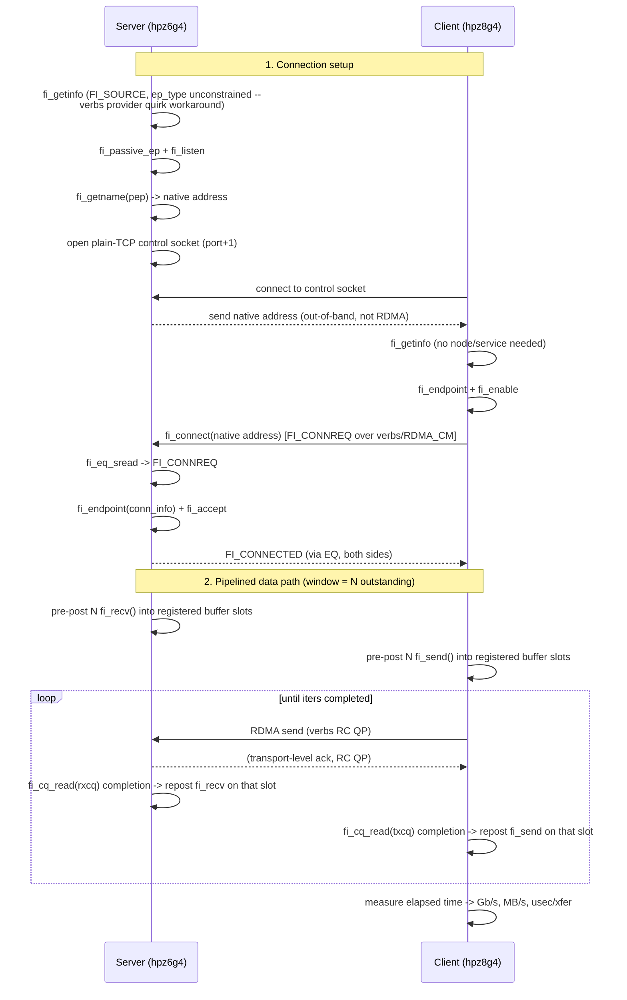
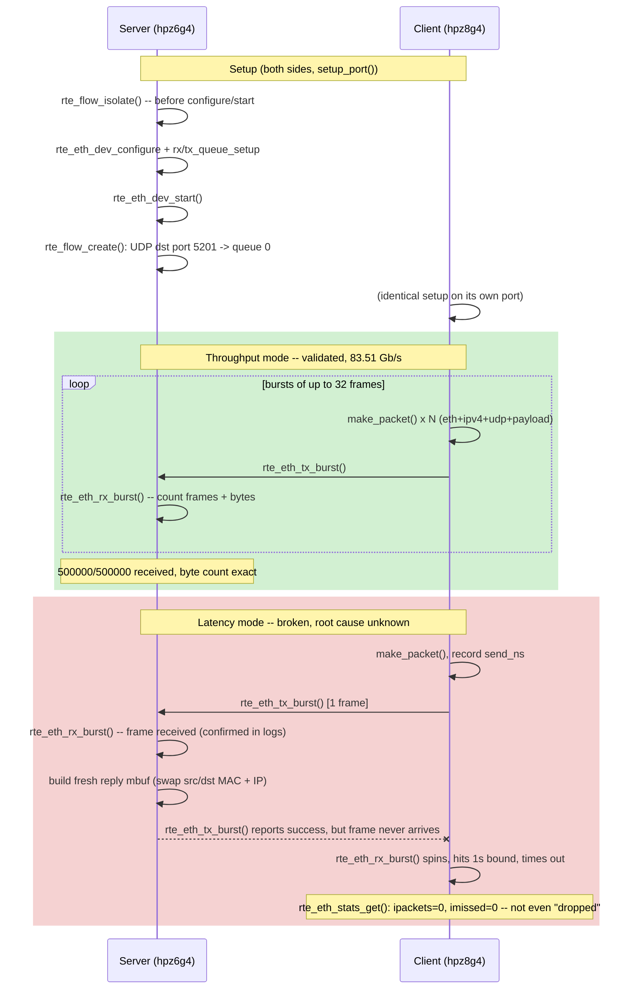

# RDMA Demo (RoCE, ConnectX-4)

Two-node RDMA demo between:

| Host    | IP (RoCE link) | Device      |
|---------|-----------------|-------------|
| hpz8g4  | 192.168.100.1   | rocep21s0   |
| hpz6g4  | 192.168.100.2   | rocep45s0   |

Both hosts have a Mellanox ConnectX-4 connected by a direct QSFP28 cable
(no switch). The cards are single-port and were switched from native
InfiniBand to Ethernet mode (`LINK_TYPE_P1=ETH` via `mstconfig`) because
the cable wasn't recognized for native IB link training and there's no
Subnet Manager on this point-to-point link. RoCE (RDMA over Converged
Ethernet) avoids both issues.

## Prerequisites

Already installed on both hosts: `rdma-core`, `perftest`, `ibverbs-utils`,
`infiniband-diags`, `libfabric-bin`, `mstflint`.

For building/debugging the C++ program in `src/` (`libfabric-dev`,
`build-essential`, `gdb`, `valgrind`, `clang-format`, `clangd`, `bear`):

```bash
sudo apt-get install -y libfabric-dev pkg-config build-essential \
    gdb valgrind clang-format clangd bear
```

```bash
cd src
make              # optimized build: fi_bw
make fi_bw-debug  # -O0 -g -fsanitize=address,undefined, for gdb/debugging
bear -- make      # regenerates compile_commands.json for clangd/editor IntelliSense
```

`.clang-format` at the repo root defines the style (Google-based, 4-space
indent, 90-col limit) — run `clang-format -i src/fi_bw.cpp` to apply it.

## Setup steps (from scratch)

1. **Install tools** on both hosts:
   ```bash
   sudo apt-get install -y rdma-core infiniband-diags perftest \
       ibverbs-utils libfabric-bin mstflint
   ```

2. **Check current link type** of the ConnectX-4 (native IB by default on
   these cards):
   ```bash
   sudo mstconfig -d <pci-bdf> query | grep LINK_TYPE
   # LINK_TYPE_P1  IB(1)
   ```

3. **Switch to Ethernet mode** on both cards. Native IB requires the cable
   to be certified for IB link training and a Subnet Manager to bring the
   port to ACTIVE — neither was available on this point-to-point link, so
   the port sat at `phys_state: Disabled`. RoCE avoids both:
   ```bash
   sudo mstconfig -d <pci-bdf> set LINK_TYPE_P1=ETH
   ```

4. **Apply without a full reboot** using a firmware/PCI reset:
   ```bash
   sudo mstfwreset -d <pci-bdf> reset
   ```
   The RDMA device is renamed by udev after this (e.g. `mlx5_0` ->
   `rocep21s0`) since it's now Ethernet/RoCE instead of native IB.

5. **Verify link is up**:
   ```bash
   ibv_devinfo -d <rocep...>   # state should be PORT_ACTIVE / phys LinkUp
   ip -br link show            # interface should show LOWER_UP
   ```

6. **Assign IPs** for a direct point-to-point link (no switch):
   ```bash
   # host A
   sudo ip addr add 192.168.100.1/24 dev <iface>
   # host B
   sudo ip addr add 192.168.100.2/24 dev <iface>
   ping 192.168.100.2   # sanity check from host A
   ```

7. Run the demo scripts below.

## Usage

Run the server side first on one host, then the client side on the other,
passing the *server's* RoCE IP.

```bash
# on hpz6g4 (server)
scripts/run.sh server bw

# on hpz8g4 (client)
scripts/run.sh client bw 192.168.100.2
```

Test types: `bw` (bandwidth), `lat` (latency), `rate` (small-message rate).

## libfabric demo

Same fabric, different API layer: `fi_pingpong` (from `libfabric-bin`)
exercises the `verbs` provider, which sits on top of the same `rocep*`
ibverbs devices used above.

```bash
# on hpz6g4 (server)
scripts/run_libfabric.sh server

# on hpz8g4 (client)
scripts/run_libfabric.sh client 192.168.100.2
```

Notes:
- `-e msg` is required. The default endpoint type (`dgram`) doesn't match
  the `rocep*` domain's `FI_EP_MSG` type (`FI_PROTO_RDMA_CM_IB_RC`), so
  `fi_getinfo()` fails with "No data available" if you omit it.
- Avoid `-S all`: the default `RLIMIT_MEMLOCK` (8MB, `ulimit -l`) on these
  hosts is too small for the larger sizes in fi_pingpong's default sweep,
  and `fi_mr_reg()` fails with `ENOMEM` partway through. The script pins a
  single size (default 64KB) instead.
- **64KB isn't a requirement** — it's just the default in
  `run_libfabric.sh`, chosen to roughly mirror the `ib_write_bw` bandwidth
  test size above so the two tools' numbers are comparable. Any size
  works as an explicit argument, e.g.
  `scripts/run_libfabric.sh client 192.168.100.2 4096`; we also ran it at
  2 bytes to get matched-size latency numbers (see below). The only real
  ceiling is the memlock limit above — raise
  `RLIMIT_MEMLOCK`/`/etc/security/limits.conf` on both hosts if you want
  `-S all` to run without hitting `ENOMEM`.

## libfabric pipelined bandwidth demo (`fi_bw`)

`fi_pingpong`'s lower bandwidth numbers (see below) are mostly an artifact
of it never keeping more than one message outstanding. `src/fi_bw.cpp` is
a small custom C++ program that keeps several sends/recvs outstanding at
once — like `ib_write_bw`'s `TX depth` — to get a real saturation
bandwidth number out of libfabric instead. It also works around a real
provider quirk (see the comment at the top of the file): the verbs
provider's server-side (source/listen) address resolution reliably fails
for a plain IP on this setup, so client and server exchange the server's
native libfabric address over a small out-of-band plain-TCP control
channel before connecting, the same pattern used internally by
`fabtests`' example programs.

### Architecture



Key structural points:
- **Two CQs per endpoint** (`txcq`/`rxcq`), each sized `window + 8`, so up
  to `window` operations can be in flight without stalling on completion
  processing.
- **One registered memory region per side** (`fi_mr_reg`), sized
  `size * window`, sliced into `window` fixed buffer slots reused across
  iterations — no per-message allocation or registration.
- **`fi_context` array doubles as the completion-to-slot map**: each
  outstanding operation's context pointer is `&ctx[i]`; on completion,
  `(fi_context*)cqe.op_context - ctx.data()` recovers which buffer slot to
  repost, so there's no separate lookup table.
- **The control channel is plain BSD sockets**, entirely separate from
  the RDMA path — it exists only to move ~dozens of bytes (the server's
  native address) once, before any RDMA traffic starts.

Build and run:

```bash
cd src && make

# on hpz6g4 (server)
../scripts/run_fi_bw.sh server

# on hpz8g4 (client)
../scripts/run_fi_bw.sh client 192.168.100.2
```

Args: `size` (default 65536), `window` = max outstanding sends (default
16), `iters` (default 20000).

Results (64KB, tuned: performance governor + NUMA pin), by window depth —
confirms pipelining, not libfabric itself, was capping `fi_pingpong`'s
bandwidth:

| Window | Bandwidth |
|---|---|
| 1 | 30.3 Gb/s |
| 16 | 83.4 Gb/s |
| 64 | 89.2 Gb/s |

For comparison: `ib_write_bw` (TX depth 128) reaches ~92.5 Gb/s, and
`fi_pingpong` (no pipelining) reaches ~42.7 Gb/s. `fi_bw` at window 64
closes almost all of that gap using the same libfabric `verbs` provider —
confirming the earlier explanation that lack of pipelining, not libfabric
overhead, was the dominant factor in `fi_pingpong`'s lower bandwidth.

Reference result (64KB, msg endpoint, round-trip): ~5.3 GB/s (~42.7 Gb/s),
~12.3 us/xfer. Lower than the one-way `ib_write_bw` throughput above
because pingpong is a request/ack round trip rather than a streamed,
multi-outstanding-request transfer.

## Why native IB mode didn't work

Both ports initially sat at `state: DOWN` / `phys_state: Disabled` in native
InfiniBand mode, even with the cable freshly reseated on both ends. Two
separate requirements of native IB weren't met here:

1. **Cable/module IB certification.** ConnectX-4 firmware checks the
   transceiver/cable's SFF-8636 EEPROM for an explicit InfiniBand
   application code before attempting IB link training. Many QSFP DACs —
   including the one used here, which had previously worked fine in
   Ethernet mode — only advertise Ethernet support in that EEPROM. If the
   module doesn't self-identify as IB-capable, the firmware refuses to
   train the link at all, and the port stays `Disabled` rather than
   progressing through `Polling` -> `LinkUp`.

2. **No Subnet Manager.** Native IB needs a Subnet Manager (SM) to assign
   LIDs and bring a port from physical `LinkUp` to logical `ACTIVE`. This
   is a direct cable between two hosts with no switch, and neither host
   was running `opensm`. Even if the cable had trained successfully at the
   physical layer, the port would have stalled at `INIT` with no SM to
   finish bringing it up.

Switching `LINK_TYPE_P1` to `ETH` sidesteps both: Ethernet link training
doesn't gate on an IB-specific cable identifier, and Ethernet/RoCE has no
Subnet Manager dependency — link-up is link-up. That's confirmed by the
link coming up immediately after the `mstfwreset` in Ethernet mode, on the
exact same cable and ports that wouldn't train in IB mode.

## TODO

- [ ] Fix `fi_bw -P tcp` (`src/fi_bw.cpp`): the per-connection endpoint
  built from the `FI_CONNREQ` info tries to rebind to the passive
      endpoint's own listening address:port, and the `tcp` provider
      rejects that with `EADDRINUSE`. Only affects `-P tcp` — `-P verbs`
      (the default) is unaffected. See the `TODO` comment in
      `run_server()` and the "TCP baseline" section above, where
      `fi_pingpong -p tcp` was used as a workaround for the TCP numbers
      instead.

- [ ] Fix `dpdk_perf` latency mode (`src/dpdk_perf.cpp`): the server's
      echoed reply never reaches the client. Throughput mode (one-way
      client-to-server) works and is validated (500000/500000 frames,
      83.5 Gb/s). Only the echo/round-trip path is broken.

      **Symptom:** client's own `rte_eth_stats_get()` shows
      `ipackets=0, imissed=0, rx_nombuf=0` after every attempt — not
      "received," not "dropped," just never classified as arriving at
      all — while the server reports `tx_burst()` fully succeeded for
      every echo.

      **Debugging trail** (each step ruled something out):
      1. Original version matched a raw non-IP EtherType (0x88B5).
         Suspected the ConnectX-4's flow steering hardware doesn't
         reliably classify arbitrary non-IP EtherTypes in isolated mode
         even though `rte_flow_create()` accepts the rule without
         error. Rewrote to use real IPv4/UDP framing (dst port 5201,
         matching the proven-working `testpmd` pattern) -- no change.
      2. Suspected undersized (runt) frames: the original packet was
         14+16=30 bytes, under Ethernet's 60-byte minimum. Padded to
         60B -- no change (and the UDP version is naturally 58B+ anyway).
      3. Suspected RX-mbuf-reuse metadata (leftover RX offload flags
         confusing the TX path) from mutating the received mbuf in
         place for the echo. Rewrote to allocate a fresh mbuf per
         reply instead -- no change.
      4. Used `testpmd` (proven reliable throughout this README) to
         isolate further: `testpmd --forward-mode=mac` on the server
         (the built-in equivalent of "swap MACs and retransmit") with
         `testpmd --forward-mode=txonly` blasting traffic from the
         client. Result: server received and retransmitted ~30.18M
         packets; client's own counters showed `RX-dropped: ~30.18M`
         (not `RX-packets`) -- because `txonly` mode never calls
         `rte_eth_rx_burst()` at all, so its RX ring fills and every
         matching arrival is dropped. This *proves the round trip
         mechanism itself works* -- replies do physically arrive and
         do get classified by the flow rule. It just doesn't explain
         why my own client (which polls RX continuously, unlike
         `txonly`) sees literal zeros instead of even a nonzero
         `imissed` count.
      5. Confirmed identical `link: UP, speed=100000 Mbps` and
         `flow rule installed: ... (handle=0x40)` output on both ends;
         ruled out a silent setup failure.
      6. Tested with 60 iterations instead of 5 in case of a
         cold-start/flow-cache-warmup effect -- still 100% timeouts,
         ruling that out too.

      **Net effect:** the failure is specific to my own program's
      client-side RX path in a way that differs from `testpmd`'s, but
      exactly how remains unidentified. Given `testpmd icmpecho`
      already provides a working DPDK latency number (documented
      above), this wasn't pursued further, but a fresh pair of eyes on
      `run_client_latency()`/`setup_port()` in `src/dpdk_perf.cpp`
      might spot something the above process didn't.

## Reference results (2026-09-12, direct cable, 100Gb ConnectX-4)

- Bandwidth (64KB, RDMA Write): ~92.5 Gb/s
- Latency (2B, RDMA Write): ~0.94 us typical/average
- Message rate (2B, Send): ~3.6 Mpps

## Comparison: native IB vs Ethernet/RoCE vs libfabric

| | Native InfiniBand | Ethernet/RoCE (perftest) | libfabric (`verbs` provider) |
|---|---|---|---|
| Tooling | `ib_write_bw`, etc. | `ib_write_bw`, `ib_write_lat`, `ib_send_bw` | `fi_pingpong` |
| Link status here | Never came up (`phys_state: Disabled`) | `PORT_ACTIVE` / `LinkUp` | Same link as RoCE column — libfabric rides on top of the `rocep*` ibverbs device |
| Requires cable IB certification | Yes — blocked us | No | No |
| Requires Subnet Manager | Yes — would have blocked us too | No | No |
| API level | Raw verbs | Raw verbs | OFI abstraction over verbs (portable across verbs/EFA/PSM2/tcp/etc without app changes) |
| Bandwidth (64KB) | n/a (link never up) | ~92.5 Gb/s (one-way RDMA Write) | ~42.7 Gb/s round-trip (ping-pong, not directly comparable to one-way BW) |
| Latency | n/a | ~0.94 us (2B, RDMA Write) | ~12.3 us/xfer (64KB round-trip, includes full request/ack cycle) |

Key takeaway: native IB and RoCE ultimately move data the same way — both
go through the same `ib_core`/`mlx5_ib` verbs stack and the same NIC
hardware. The difference here was entirely in **link establishment**
(see below), not in the RDMA data path itself. libfabric doesn't add a
new transport; it's a portable API sitting on top of the same verbs
device, so its numbers reflect the underlying RoCE link plus libfabric's
own protocol/framing overhead rather than a competing fabric.

### TCP baseline, same tool and wire

libfabric also has a plain `tcp` provider (normal kernel sockets, no
RDMA). Running the exact same `fi_pingpong -e msg` benchmark against it
over the identical NIC/cable — the only thing that changes is `-p tcp`
instead of `-p verbs` — gives a clean apples-to-apples RDMA-vs-TCP
comparison, since it's the same tool, same sizes, same physical link:

```bash
# server
fi_pingpong -p tcp -e msg -S 65536 -I 1000

# client
fi_pingpong -p tcp -e msg -S 65536 -I 1000 192.168.100.2
```

| | TCP (`fi_pingpong -p tcp`) | RoCE (`fi_pingpong -p verbs`) | RoCE advantage |
|---|---|---|---|
| Bandwidth (64KB, round-trip) | 1266 MB/s (~10.1 Gb/s) | 5340 MB/s (~42.7 Gb/s) | ~4.2x |
| Latency (2B, round-trip) | 12.54 us/xfer | 2.30 us/xfer | ~5.4x lower |

Same message sizes, same unpipelined ping-pong pattern, same physical
cable — the difference here is entirely the kernel TCP/IP stack (socket
syscalls, kernel copies, interrupt-driven processing) versus RDMA's
kernel-bypass, zero-copy data path. This is the number that actually
justifies bothering with RDMA/RoCE in the first place, as opposed to the
native-IB-vs-RoCE story above, which was purely about link setup, not a
real performance difference.

Note: our own `src/fi_bw.cpp` doesn't work with `-P tcp` yet — the tcp
provider tries to bind the new per-connection endpoint (created from the
`FI_CONNREQ` event's info) to the same address:port the passive endpoint
is already listening on, which fails with `EADDRINUSE`. This doesn't
happen with the `verbs` provider (each connection gets its own RDMA_CM
identifier, no shared socket to collide on). `fi_pingpong` handles the
tcp case correctly internally, so it was used for this comparison
instead.

### Why the latency numbers differ so much (0.94us vs 12.3us)

The `ib_write_lat`/`fi_pingpong` latency figures above aren't actually an
apples-to-apples comparison — two effects stack up:

1. **Message size dominates.** `ib_write_lat` used a 2-byte payload;
   `fi_pingpong` (as invoked by `run_libfabric.sh`) defaults to 64KB. At
   ~100Gb/s, just serializing 64KB one-way takes ~5.24us
   (64*1024*8 bits / 100e9 bits/s); round-trip that's ~10.5us of pure wire
   time — nearly the entire measured 12.3us. Re-running `fi_pingpong` at a
   matched 2-byte size gives ~2.30us, much closer to the RDMA write number.

2. **Operation type accounts for the rest.** `ib_write_lat` issues an
   **RDMA Write with inline data** — the payload rides inside the work
   request (no separate memory fetch), it's **one-sided** (the remote
   CPU/software is never involved; the NIC places data directly into
   remote memory), measured in a tight polling loop with TX depth 1 and
   nothing else happening. `fi_pingpong` uses **Send/Recv (two-sided)** —
   the receiver must have a receive buffer already posted and generates
   its own completion, and the benchmark does an explicit
   send-then-wait-for-ack round trip on top of libfabric's own progress
   engine. Same NIC, same RC QP under the hood, but inherently more
   round-trip machinery for a two-sided op than a one-sided inline write.

| Test | Size | Latency |
|---|---|---|
| `ib_write_lat` | 2B | 0.94 us |
| `fi_pingpong` | 2B | 2.30 us |
| `fi_bw` (`-w 1`, our program) | 2B | 3.75 us |
| `fi_pingpong` | 64KB | 12.3 us |

`fi_bw -w 1` (one outstanding send, waiting for its completion before
posting the next — see the libfabric bandwidth demo section below) is a
third data point on the same spectrum: still Send/Recv (two-sided, needs
a receive buffer posted on the far end) like `fi_pingpong`, but without
`fi_pingpong`'s explicit application-level send-then-wait-for-a-separate-
ack-message protocol — just the send completion itself. It lands higher
than `fi_pingpong`'s 2.30us here, which is a reminder that these
mini-benchmarks (a plain busy-poll loop, no warm-up, 5000 iterations) are
illustrative, not tightly controlled — take the relative ordering
(one-sided inline write < two-sided send-completion-only < two-sided
explicit ping-pong) as the reliable signal, not small differences between
runs.

### Why libfabric's bandwidth is lower too

Same root causes as the latency gap, but one factor dominates for
bandwidth specifically:

1. **No pipelining (the main factor).** `ib_write_bw` keeps 128 RDMA
   writes outstanding at once (`TX depth: 128`), overlapping each
   message's latency so the link stays saturated — that's how it reaches
   near-line-rate (92.5 Gb/s). `fi_pingpong` does the opposite by design:
   it sends one message, waits for the full round-trip ack, then sends
   the next. With nothing overlapped, throughput is capped at
   `message_size / round_trip_time`, not by the link's real capacity.
   Check the math: 64KB / 11.64us RTT (tuned run) is ~45 Gb/s — almost
   exactly what was measured. It isn't hitting a hardware ceiling; it's
   just never given more than one in-flight request to hide latency
   behind.

2. **Two-sided vs one-sided.** Same as the latency explanation above —
   `ib_write_bw` is one-sided RDMA Write; `fi_pingpong` is two-sided
   Send/Recv with a posted receive buffer and completion on both ends.

3. **Abstraction overhead (minor).** libfabric's OFI layer adds a
   provider-agnostic dispatch (`fi_*` calls into the `verbs` provider)
   versus perftest calling `ibv_post_send`/`ibv_poll_cq` directly. Real,
   but small next to #1 and #2.

A true apples-to-apples libfabric bandwidth number would need a pipelined
benchmark — e.g. `fi_msg_bw` from the `fabtests` suite (posts many
outstanding sends, like `ib_write_bw` does), rather than `fi_pingpong`.
`fabtests` isn't included in the `libfabric-bin` package installed here,
only `fi_pingpong`/`fi_msg_pingpong`-style tools, so this repo's libfabric
numbers should be read as a two-sided, unpipelined latency-bound
benchmark rather than a saturation bandwidth test.

### Tuning libfabric

Every perftest/libfabric run logged `CPU Frequency is not max` — both
hosts default to the `powersave` cpufreq governor, which lets cores clock
down between the polling loop's completion checks. RDMA latency
benchmarks are exactly the workload this hurts most. Fix in two steps:

1. **Install the tools** (both hosts):
   ```bash
   sudo apt-get install -y numactl linux-cpupower
   ```

2. **Switch the CPU governor to `performance`**:
   ```bash
   sudo cpupower frequency-set -g performance
   # verify:
   cat /sys/devices/system/cpu/cpu*/cpufreq/scaling_governor | sort -u
   # -> performance
   ```
   This only affects the running kernel — it resets to `powersave` on
   reboot unless you make it persistent. To persist, add a systemd unit
   that runs the same command at boot:
   ```ini
   # /etc/systemd/system/cpu-performance.service
   [Unit]
   Description=Set CPU governor to performance
   After=multi-user.target

   [Service]
   Type=oneshot
   ExecStart=/usr/bin/cpupower frequency-set -g performance

   [Install]
   WantedBy=multi-user.target
   ```
   ```bash
   sudo systemctl daemon-reload
   sudo systemctl enable --now cpu-performance.service
   ```

3. **Find the NIC's local NUMA node** so the benchmark process runs on
   CPUs physically close to the card (avoids cross-socket memory/PCIe
   traffic):
   ```bash
   cat /sys/class/infiniband/<dev>/device/numa_node
   # both hosts here: node 0
   ```

4. **Pin the process with `numactl`** when running the demo:
   ```bash
   numactl --cpunodebind=0 --membind=0 fi_pingpong -p verbs -d <dev> -e msg -S <size> ...
   ```
   (Swap in whichever node number step 3 reported if it isn't 0.)

5. **Re-measure and compare** — this is what isolates whether the tuning
   actually helped versus noise:

   | | Default (powersave, no pinning) | Tuned (performance + NUMA pin) |
   |---|---|---|
   | Latency (2B) | 2.30 us | 1.44 us (~37% lower) |
   | Bandwidth (64KB) | 5340 MB/s (~42.7 Gb/s) | 5632 MB/s (~45.1 Gb/s) (~5% higher) |

Note: `cpupower frequency-set` is not persistent across reboots on its
own — set it via a systemd unit or `tuned` profile if you need it to
survive a restart.

## DPDK compatibility

DPDK is installed on both hosts (see "Setup" below) alongside the RDMA
setup above — this section documents whether/how it coexists without
disrupting the RDMA path.

**Why a basic setup is safe:** DPDK's `mlx5` PMD attaches to the
ConnectX-4 through the same `mlx5_core`/`mlx5_ib` kernel driver and
`libibverbs` stack the RDMA tools in this repo already use — it's a
"bifurcated" model, not exclusive ownership. It opens its own QPs/CQs via
verbs, the same way `fi_bw`, `ib_write_bw`, etc. do. Multiple independent
verbs consumers can coexist on one port simultaneously (this repo's own
tools have done exactly that all session — perftest, `fi_pingpong`, and
`fi_bw` each opening/closing connections on `rocep21s0` back-to-back with
no conflicts). A default-mode `dpdk-testpmd` run wouldn't touch the RDMA
path or require any link reset.

### Setup (done on both hosts)

```bash
sudo apt-get install -y dpdk dpdk-dev libdpdk-dev

# reserve 1024 x 2MB = 2GB hugepages, and make it persist across reboots
sudo sysctl -w vm.nr_hugepages=1024
echo 'vm.nr_hugepages=1024' | sudo tee /etc/sysctl.d/60-dpdk-hugepages.conf
```

IOMMU was already active (165 IOMMU groups) and `hugetlbfs` was already
mounted at `/dev/hugepages`, so those needed no changes.

Verified the bifurcated model held after installing — the ConnectX-4 is
still bound to the kernel driver, not `vfio-pci`, and both the netdev and
the RDMA device remain live:

```
$ dpdk-devbind.py --status
Network devices using kernel driver
===================================
0000:15:00.0 'MT27700 Family [ConnectX-4] 1013' numa_node=0 if=enp21s0np0 drv=mlx5_core unused= *Active*
```

### Validated: flow-isolated testpmd coexists cleanly

Tested this directly rather than leaving it as a guess. Note the correct
flag is `--flow-isolate-all` (not `--flow-isolate-mode`, which doesn't
exist and errors out):

```bash
sudo dpdk-testpmd -l 0-2 -n 4 -a 0000:15:00.0 -- --flow-isolate-all
```

The log confirms isolation actually took effect before any port state
changed:

```
Ingress traffic on port 0 is now restricted to the defined flow rules
...
mlx5_net: port 0 cannot enable promiscuous mode in flow isolation mode
```

**Test procedure:** measured `fi_bw` (64KB, window 16) three times —
before starting `testpmd`, concurrently while it was running (holding its
own RX/TX queue on the same port, isolated, forwarding nothing since no
explicit `rte_flow` rules were added), and again after a clean shutdown:

| | Bandwidth |
|---|---|
| Before `testpmd` | 82.93 Gb/s |
| While `testpmd` running | 82.03 Gb/s |
| After `testpmd` exit | 83.03 Gb/s |

All three within ~1% of each other — no measurable regression. RoCE port
state stayed `ACTIVE` and the kernel netdev stayed `UP` throughout, and
`testpmd` shut down cleanly (`Port 0 is closed` / `Bye...`) without
requiring a link reset. This confirms the theoretical bifurcated-model
argument above with an actual measurement: a flow-isolated DPDK app can
run against this NIC alongside the RDMA path with no impact, as long as
you don't add `rte_flow` rules that redirect traffic the RDMA path
depends on.

Still untested: whether a *non-isolated* `testpmd` run (default flow
mode, no `--flow-isolate-all`) would actually steal RoCEv2/OOB-control
traffic as theorized above. Given isolation mode works and coexists
cleanly, there was no reason to test the riskier non-isolated path
against a live link.

### DPDK's own throughput and latency

Measured DPDK's raw forwarding performance directly, still with
`--flow-isolate-all` and explicit narrow `rte_flow` rules (never a
wildcard capture) — same safety posture as the coexistence test above.

**Throughput** — `testpmd` in `txonly` mode (this host) generating UDP
traffic to `testpmd` in `rxonly` mode (`hpz6g4`), 1470-byte frames, an
explicit flow rule matching only UDP dst port 9999:

```bash
# receiver (hpz6g4)
dpdk-testpmd -l 0-2 -n 4 -a 0000:2d:00.0 -- --forward-mode=rxonly \
    --stats-period=2 --flow-isolate-all -i
# at the testpmd> prompt:
#   flow create 0 ingress pattern eth / ipv4 / udp dst is 9999 / end actions queue index 0 / end
#   start

# sender (this host)
dpdk-testpmd -l 0-2 -n 4 -a 0000:15:00.0 -- --forward-mode=txonly \
    --stats-period=2 --flow-isolate-all --eth-peer=0,<receiver-MAC> \
    --tx-ip=192.168.100.1,192.168.100.2 --tx-udp=9999,9999 --txpkts=1470
```

- **~81.2–81.3 Gb/s sustained**, **~6.9 Mpps**
- **~0.1% drop rate** on the receiver's own counter (57,494 of 57.16M
  packets while both sides were concurrently running) — attributable to
  the default 256-descriptor RX ring at near-line-rate load, not a real
  problem; a larger `--rxd` or multiple RX queues would likely close it
- For context: close to `ib_write_bw`'s 92.5 Gb/s, well above
  `fi_pingpong`'s 42.7 Gb/s — raw DPDK forwarding of always-outstanding
  frames is architecturally closer to `ib_write_bw`'s approach than to
  `fi_pingpong`'s unpipelined ping-pong.

Caveat from the first attempt at this: the two `testpmd` instances were
started a few seconds apart with mismatched hold durations, so the
receiver's listen window ended before the sender stopped transmitting —
its cumulative packet counts (57M received vs. 221M sent) looked like a
~74% loss rate but was purely a test-harness timing artifact, not real
network loss. The reliable number is the 0.1% drop rate from the period
both sides were verifiably running concurrently.

**Latency** — `testpmd`'s `txonly`/`rxonly` modes don't produce
per-packet latency; DPDK's `--latencystats` timestamp feature needs
synchronized clocks between hosts (e.g. PTP) to give a meaningful
one-way number, which isn't set up here. Instead, used the standard
"ping a DPDK `icmpecho` responder" trick: `testpmd` in `icmpecho` mode
on `hpz6g4`, isolated with an explicit ICMP-only flow rule, answering
plain kernel `ping` from this host — a widely-used way to demonstrate
DPDK's kernel-bypass reply path using an ordinary RTT tool instead of
needing synchronized clocks:

```bash
# responder (hpz6g4)
dpdk-testpmd -l 0-2 -n 4 -a 0000:2d:00.0 -- --forward-mode=icmpecho \
    --flow-isolate-all -i
# at the testpmd> prompt:
#   flow create 0 ingress pattern eth / ipv4 / icmp / end actions queue index 0 / end
#   start

# this host
ping -I enp21s0np0 -c 30 -i 0.2 192.168.100.2
```

| | RTT avg | RTT min |
|---|---|---|
| Kernel-to-kernel (no DPDK) | 0.202 ms | 0.165 ms |
| DPDK `icmpecho` responder | 0.099 ms | 0.075 ms |

**Roughly half the round-trip latency**, 0% packet loss (30/30 both
ways) — the reply path skips the kernel network stack entirely, going
straight from NIC RX to a userspace ICMP reply and back out TX.

Both tests: RoCE link state stayed `ACTIVE` throughout and after on both
hosts, and a `fi_bw` bandwidth check immediately after each test matched
the established baseline (~83 Gb/s) — no regression from any of this.

### Custom DPDK C++ perf tool (`dpdk_perf`)

`src/dpdk_perf.cpp` is a `fi_bw`-style custom program against raw
`ethdev`/`rte_flow` instead of libfabric verbs — same safety posture
(isolated port, one narrow explicit flow rule matching UDP dst port
5201, nothing else ever redirected). Build with `make dpdk_perf`
(needs `libdpdk-dev`, already installed).

```bash
# server (hpz6g4)
sudo ./dpdk_perf -l 0-1 -n 4 -a 0000:2d:00.0 -- server \
    ec:0d:9a:a4:cc:86 192.168.100.2 192.168.100.1 throughput

# client (hpz8g4)
sudo ./dpdk_perf -l 0-1 -n 4 -a 0000:15:00.0 -- client \
    ec:0d:9a:78:62:72 192.168.100.1 192.168.100.2 throughput 1470 500000
```

**Throughput mode works and is validated end-to-end**: 500,000/500,000
frames received exactly (735,000,000 bytes = 500000 x 1470B, no loss),
**83.51 Gb/s, 7.1 Mpps** — consistent with the `testpmd`-based
measurement above (~81.2 Gb/s). This mode only needs the proven
unidirectional client-to-server path.

**Latency mode has an open, unresolved bug** (see TODO below): the
server-side echo-reply never arrives back at the client, even though
extensive isolation testing proved the round trip mechanism itself
works (see "Debugging trail" in the TODO entry). Use the `testpmd
icmpecho` approach above for a working DPDK latency number instead.

#### Architecture



Note the asymmetry the diagram is built around: the same `setup_port()`
code runs on both sides, and `testpmd`'s `mac`-forward mode proved this
exact reply mechanism *can* work on this hardware (a separate test, not
`dpdk_perf` itself) — so the failure is specific to something in this
program's client-side receive path that six rounds of isolation testing
didn't identify. See the TODO entry for the full debugging trail.

**What would actually break the RDMA flow:**

1. **`dpdk-devbind.py` unbinding the NIC to `vfio-pci`/`igb_uio`.** This
   is the standard DPDK setup step for most NICs, but it's the *wrong*
   move for mlx5 — unbinding it from `mlx5_core` rips out the same PCI
   function `ib_uverbs`/`rocep21s0` depend on, killing the RDMA device
   entirely until rebound. mlx5 is specifically designed to skip this
   step; a generic DPDK tutorial that says "bind all NICs to vfio-pci"
   is a real footgun here.

2. **Switching the NIC into switchdev/eswitch mode**
   (`devlink dev eswitch set ... mode switchdev`) for SR-IOV
   representor/hardware-offload use cases. That reconfigures the NIC's
   port model and **does trigger a device reset** — the same kind of
   link flap we saw from `mstfwreset` when switching `LINK_TYPE_P1`
   earlier in this README. RDMA connections would drop during that
   reset.

3. **Reconfiguring queue/VF counts via `mstconfig`** (e.g. changing
   `NUM_OF_VFS` for SR-IOV) — same story: a firmware-level change
   requiring `mstfwreset`, causing a brief link interruption.

4. **Bandwidth contention** isn't "breaking" per se, but worth noting:
   DPDK traffic and RDMA traffic share the same physical 100Gb link and
   PCIe lanes, so running both under heavy load at the same time means
   they compete for wire bandwidth.

Bottom line: a basic `dpdk-testpmd` run in default legacy mode, with no
`devbind` and no eswitch mode change, is safe and coexists fine with the
RDMA setup here. SR-IOV/switchdev-style DPDK testing is a separate, more
invasive step that should be planned for a time when nothing else needs
the RDMA link live.
